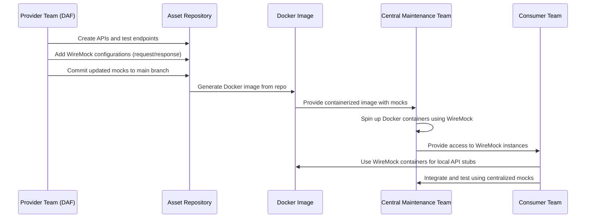

# Provider-Driven Mocks with DAF Example

---

## Overview
This document explains the workflow for implementing **Provider-Driven Mocks** using DAF as the provider team. The provider-driven mocks approach centralizes mock configuration and management to ensure consistency across all consumers. The process involves creating WireMock configurations, generating Docker images, and maintaining a centralized environment for API mock integration.

---

## Workflow Steps

1. **Provider Team (DAF) Responsibilities**:
   - Create APIs and test their endpoints.  
   - Define mock configurations (using **WireMock**) for requests and responses.  
   - Commit updated mock configurations into the **Asset Repository** main branch.  

2. **Asset Repository**:
   - Hosts the WireMock configuration files (`request.json`, `response.json`, etc.) for each mock endpoint.  
   - Is used to generate a **Docker image** containing all mock configurations.  

3. **Docker Image**:
   - A containerized version of WireMock using the configuration files.  
   - Provides a ready-to-use stub response environment, mimicking the provider's API behavior.

4. **Central Maintenance Team**:
   - Downloads and manages Docker images for all provider teams (e.g., DAF).  
   - Creates a pipeline to spin up Docker containers for each mock API using WireMock.  
   - Provides access to the mock containers for consumer teams.

5. **Consumer Team**:
   - Uses the centralized Docker containers to integrate with provider-driven mocks.  
   - Replaces any consumer-driven mocks with provider-maintained stubs for consistency.  

---

## Sequence Diagram



---

## Benefits of Provider-Driven Mocks
1. **Centralized Mock Management**:  
   Providers maintain mock configurations, ensuring consistency across all consumers.  

2. **Simplified Integration**:  
   New consumer teams can directly use pre-configured mocks without building their own.  

3. **Reduced Duplication**:  
   Multiple consumers avoid duplicating mock behavior, as all mocks are shared through a centralized system.  

4. **Versioning and Updates**:  
   Providers handle API updates, ensuring all consumers work with the latest mock behavior.

---

## How to Use the Docker Image
1. **Download the Docker Image**:  
   The central maintenance team provides the Docker image for the required provider (e.g., DAF).  

2. **Run the Docker Container**:
   ```bash
   docker run -d -p 8080:8080 <daf-docker-image>
   ```

3. **Access the Mock Endpoints**:  
   - Use the exposed endpoints (e.g., `http://localhost:8080/mock-api`) in your local environment.  
   - Integrate with these stubs during development and testing.

4. **Integration**:
   - Replace consumer-driven mocks with provider-driven mocks for seamless integration.

---

## Conclusion
Provider-driven mocks, managed by DAF and supported by a centralized team, offer an efficient way to maintain consistency, eliminate redundancy, and simplify API integration for all consumers.
